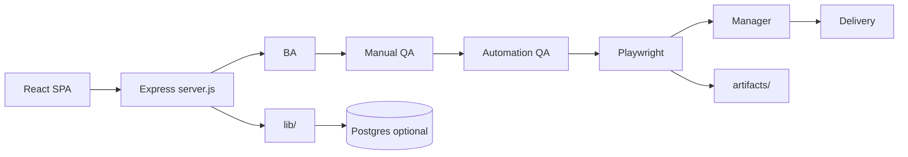
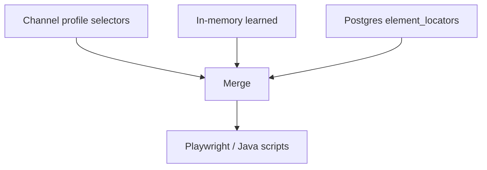
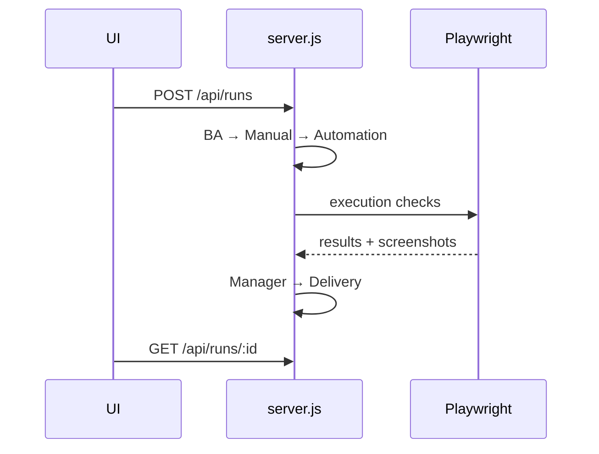

# ZER0 Diagrams

## When this skill owns the task

Any diagram request about this repo’s QA orchestration pipeline, APIs, data model, or UI↔server flow.
For Salesforce-specific Mermaid conventions, see `sf-diagram-mermaid` instead.
For layered HTML architecture panels, see `architecture` + `zero-architecture`.

## Defaults

1. Prefer **Mermaid** in fenced ` ```mermaid ` blocks for chat and Markdown docs
2. Prefer **ASCII / preformatted** inside `public/architecture.html` (already styled)
3. Prefer **HTML layered panels** only when publishing rich arch pages (follow `architecture` skill + Zero HTML path)
4. Keep labels tied to real names: stages, files, routes, tables

## Diagram type picker

| Need | Mermaid type |
|------|----------------|
| Pipeline / control flow | `flowchart LR` or `TD` |
| Request lifecycle | `sequenceDiagram` |
| Module dependencies | `flowchart` or `C4Context`-style boxes |
| DB entities | `erDiagram` |
| Run state | `stateDiagram-v2` |

Use `flowchart` (not deprecated `graph`). Top-down for stacks; left-right for pipelines.

## Canonical Zero diagrams

### Pipeline



### Locator merge



### Sequence (start run)



## Quality bar

- Every node should map to a real path, stage, or API — no vague “backend”
- Note optional pieces (Postgres, a11y/perf stages, CMS capture) as optional
- If embedding in HTML, keep diagrams readable on mobile (short labels)
- When updating docs, sync the same diagram story across chat, `AGENTS.md`, and `architecture.html` if the user asked to publish
