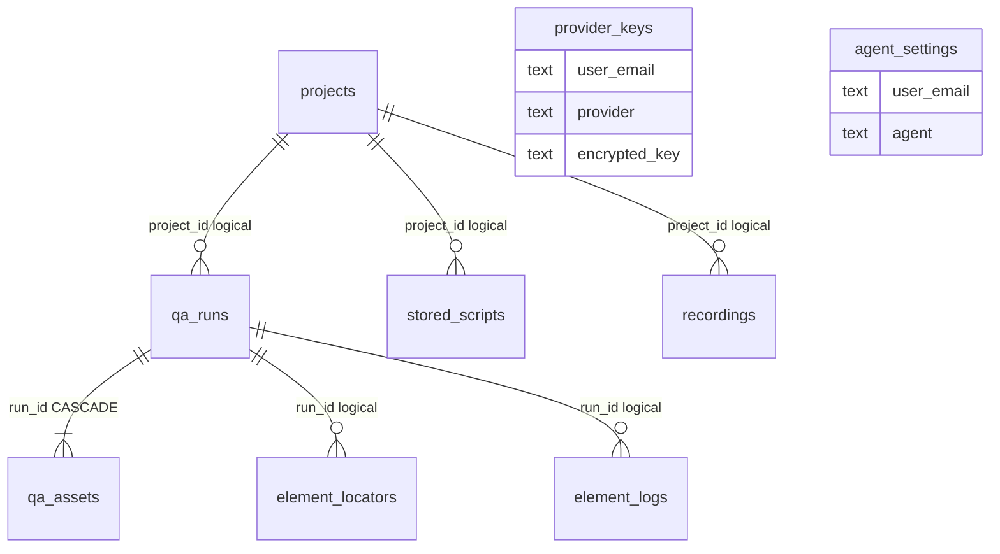

# ZER0 Architecture — V1 (current runtime)

**AI QA orchestration — what ships today.** Multi-agent pipeline with optional LLM enrich (OpenAI · Claude · Gemini) via `@zero/orchestrator/llm`, Playwright crawl + execution, and durable artifacts.

Ground truth: `services/api/server.js`, `services/orchestrator/`, `services/executor/`, `packages/*`, `web/`.

This is **what ships today**. For the IDE-style target and production gaps, see [../v2/ARCHITECTURE.md](../v2/ARCHITECTURE.md). Interactive HTML: `/architecture.html` (source: `web/public/architecture.html`). Live docs site Architecture tab: `support/zero-docs` (`:5174`).

**Day-0 onboarding:** [DEVELOPER_GUIDE.md](./DEVELOPER_GUIDE.md) §2. **Compose:** [DOCKER.md](./DOCKER.md). **Postgres ER:** [DATABASE.md](./DATABASE.md). **Cost floors:** [COST.md](./COST.md).

**Autonomous packaging / status:** `support/agent-workflow/` + `/zero-target-arch` (`npm run workflow:status`). Capability M1–M7, packaging S0–S7, and product Q1–Q4 are **done**; product **Q5** (trustworthy site understanding and test-plan quality) is reopened (`progress.json` `current: "Q5"`). UX **U1** (professional operator console) and **U2** (ultra-low-friction canvas) are **done**.

---

## Runtime diagram

```
React web/ ──npm run build──▶ dist/web/
        │
        ▼  POST /runs → queue runs.requested
┌──────────────────┐                 ┌────────────────────────────┐
│  React 18 SPA    │─SSE /runs/:id/stream─▶│  Express  @zero/api     │
│  zero-web  :3000 │  (poll fallback)       │  zero-api  :3001          │
│  Agents · Keys   │                 └──────┬───────────┬──────────┘
└──────────────────┘                        │           │
        │                                   ▼           ▼
        │ /record · /recorder.js     ┌────────────┐  @zero/executor
        └───────────────────────────▶│ packages/* │  Chromium
          recording events           │ analyzer   │      │
                                     │ builders   │      ▼
                                     │ locators   │  dist/artifacts/<runId>/
                                     │ domain · db│    run.json · screenshots
                                     │ cloud      │  dist/artifacts/cms-captures/
                                     └─────┬──────┘
                                           │  when DATABASE_URL / PGHOST set
                                           ▼
                                     PostgreSQL (@zero/db)
```

### Deployable units (S7)

| Unit | Folder · package | Port / role |
|------|------------------|-------------|
| Web | `web/` · `@zero/web` | nginx `:3000` — SPA only (no `/api` proxy) |
| API | `services/api/` · `@zero/api` | Express `:3001` — intake, SSE, signed URLs; **no Playwright** |
| Orchestrator | `services/orchestrator/` · `@zero/orchestrator` | DAG worker on `runs.requested` + LLM |
| Executor | `services/executor/` · `@zero/executor` | Playwright on `execution.requested` |

Shared libs: `@zero/{domain,locators,builders,analyzer,db,cloud}`. Services never import sibling `services/*`.

Local run modes:

- `npm start` — **API only** (`services/api/server.js`, default `PORT=3001`)
- `npm run start:all` — API + orchestrator + executor via `scripts/local-stack.js`
- `npm run client` — Vite UI `:5173` (fetches API via `VITE_API_BASE_URL`)
- Compose — four images (`web`, `api`, `orchestrator`, `executor`) + Postgres / Redis; see [DOCKER.md](./DOCKER.md)

---

## Product modes

| Mode | Input | What runs |
|------|-------|-----------|
| **Autonomous (URL-only)** | Public URL; no TC file; short/empty notes | Multi-page crawl → optional domain inference → major functional cases → `discovered_flows` execution → Manager |
| **Guided** | URL + Figma / uploaded TCs / BA notes | Same agent chain; Web Analyzer optional; CSV defaults to `minimal` execution |

Optional UI inputs: forced channel profile, runtime login credentials, headed browser (`RUN_HEADED` / “Show browser”).

---

## Pipeline (`stageKeys` in `@zero/domain`)

Order: `webAnalyzer?` → *(domainInference gate)* → `ba` → `manualQa` → `automationQa` → `execution` → optional `accessibility` / `performance` / `security` → `manager` → `delivery`.

`domainInference` is **not** a `stageKeys` entry — it is a one-shot LLM gate inside the orchestrator after Web Analyzer (`inferDomain.js`).

| Stage | When | What it actually does |
|-------|------|------------------------|
| **webAnalyzer** | No TC file and short/empty notes | Multi-page Playwright crawl via `@zero/analyzer` (`crawlLinkedPages`, `ZERO_ANALYZER_MAX_PAGES` default 8); `crawledPages`, domain type, user flows |
| **domainInference** | After Web Analyzer, before BA | One LLM call when `websiteTypeConfidence < 0.5` or type is `GENERIC`; merges into `_webAnalysisInsights`; skipped without key or `ZERO_LLM=off` |
| **ba** | Always | Template consolidation (`consolidateRequirements`), then optional LLM enrich via `@zero/orchestrator/llm` |
| **manualQa** | Always | Cases from CSV / UI rows / `majorFunctionalCases` / profile templates; optional LLM extra cases |
| **automationQa** | Always | Merge locators → Playwright + Java/Selenium text; optional LLM locator hints |
| **execution** | Always | Playwright in `@zero/executor`; **`discovered_flows`** for URL-only auto, **`minimal`** for CSV (`EXECUTION_MODE≠full`) |
| **accessibility** / **performance** / **security** | UI flags | Extra Playwright passes; security is header/cookie/content heuristics. API intake parses a11y/perf today; **`enableSecurity` is not yet mapped from the multipart body** |
| **manager** / **delivery** | Always | Deterministic report builders; Manager may add an LLM narrative when a key exists |

**Locator merge:** profile → in-memory learned → Postgres `element_locators` (`@zero/locators`).

Channel profiles (`@zero/domain` `appProfiles`): Gray, TVNZ+, Aha, Hotstar-like, PrimeVideo-like, Generic. Rule-based types also include SAAS, MARKETPLACE, ECOMMERCE, and others (`@zero/analyzer` `WEBSITE_TYPES`).

### Execution modes

| Mode | When | Behavior |
|------|------|----------|
| **`discovered_flows`** | URL-only auto (no CSV, web analysis present) | Top 3–5 critical flows — multi-step Playwright (`@zero/builders/playwright/discoveredFlows`) |
| **`minimal`** | CSV / default | Load URL, wait for body, screenshot — pipeline completes reliably |
| **`uploaded_tc_only`** | CSV upload | Checks derived from uploaded cases |
| **`full`** (`EXECUTION_MODE=full`) | Selector tuning only | Keyword/selector navigation — brittle on real sites |

In-app Manager Go/No-Go is **orchestration confidence**, not full product E2E proof. Export Java/Playwright for real CI.

---

## Persistence (today)

| Store | Mechanism | Survives restart? |
|-------|-----------|-------------------|
| Active runs | `runs` `Map` + `dist/artifacts/<id>/run.json` | Partial (disk JSON) |
| Login secrets | `runSecrets` `Map` | No |
| Recordings | in-memory Maps | No |
| Learned selectors | `selectorMemory` | No |
| Provider keys / agent settings | memory Maps (or DB if enabled) | No unless DB |
| Screenshots | object store (`runs/<id>/files/*`) + local cache under `dist/artifacts/` | Yes (object store) |

**Postgres (M1 shipped):** `databaseConfigured()` is true when `DATABASE_URL` or `PGHOST` is set; `initAllTables()` + `runPendingMigrations()` via `@zero/db` (`migrations/` → `schema_migrations`). Runs upsert on each `persistRun`; Map + `dist/artifacts/<id>/run.json` remain a cache/fallback. Login passwords stay in `runSecrets` only.

Full column catalog, indexes, and JSONB mapping: **[DATABASE.md](./DATABASE.md)**. The only enforced FK is `qa_assets.run_id → qa_runs(id) ON DELETE CASCADE`; other `project_id` / `run_id` columns are logical TEXT links.



**Object store (M2 shipped):** `ZERO_CLOUD=local` (default) writes to `dist/artifacts/cloud-store` with HMAC-signed `/cloud/local` URLs (S7 dropped the `/api` prefix). `POST /runs` can return `uploads[]` (presigned PUT) so TC/recording bytes never enter the API process; `POST /runs/:id/commit` starts the pipeline. Screenshots and `run.json` are also stored as objects. `/artifacts` is no longer statically served.

**Queue + orchestrator (M3 shipped):** `POST /runs` publishes `runs.requested` via `@zero/cloud` queue and returns 202. `@zero/orchestrator` consumes with `ZERO_ORCH_CONCURRENCY` (default 2). Stage snapshots go to `cache` (`state.<runId>`); clients use `GET /runs/:id/stream` (SSE) or poll. Standalone: `npm run orchestrator`.

**Execution farm (M4 shipped):** Orchestrator publishes `execution.requested` and waits for `execution.completed`. `@zero/executor` runs Playwright with `ZERO_EXEC_CONCURRENCY` / `ZERO_EXEC_ATTEMPTS`. The API never subscribes to execution. `npm start` is API-only; use `npm run start:all` (or Compose) for a local all-in-one stack.

**Auth & tenancy (M5 shipped):**

- Identity is a verified API key (`x-api-key` hashed against `ZERO_API_KEYS` / `ZERO_DEV_API_KEY`) or a Bearer JWT (`ZERO_AUTH_JWT_SECRET` HS256, or RS256 when `OIDC_PUBLIC_KEY` + optional `OIDC_ISSUER` / `OIDC_AUDIENCE` are set). `X-User-Email` is ignored.
- `ZERO_AUTH=on` (always on when `NODE_ENV=production`) returns 401 without a verified identity. Local/dev default is off; unauthenticated callers are scoped to tenant `local` only.
- Runs store `tenantId` (Postgres `qa_runs.tenant_id`). List/get/files/download/assets/stream/commit/rerun are tenant-filtered (mismatch → 404).
- Production refuses to boot if `KEY_ENC_SECRET` is missing or still the dev default.
- Remaining: no OIDC login UI yet.

**LLM surface (M6 shipped):** UI stores Claude / OpenAI / Gemini keys (`/provider-keys`) and per-agent model/prompt (`/agent-settings`). `processRun` decrypts the key and calls the provider through `@zero/orchestrator/llm`. Template output is always the base; enrichment is best-effort. **Automatic domain inference** runs once after Web Analyzer when rule-based confidence is low (`domainInference` prompt). Guardrails: `ZERO_LLM_RPM` (default 20), `ZERO_LLM_MAX_USD_PER_RUN` (default $0.50), prompt versions `ba.v1` / `manager.v1` / `manualQa.v1` / `automationQa.v1` / `domainInference.v1`. `ZERO_LLM=off` forces templates. Env keys (`OPENAI_API_KEY` etc.) are used only when `ZERO_LLM_ENV_KEYS=1`. Artifacts stamp `metadata.llm` (`used`, `provider`, `promptVersion`, `fallbackReason`). Keys are never logged in full.

**Multi-cloud (M7 shipped):** `ZERO_CLOUD=local|aws|gcp|azure|vercel`. Primary production paths with IaC: `aws` (S3 / SQS / Secrets Manager / Redis) and `gcp` (GCS / Pub/Sub / Secret Manager / Redis). Azure and Vercel adapters ship under `packages/cloud/**` with GATE-9 conformance; SDKs are lazy-required. Default remains `local`. IaC: `infra/aws`, `infra/gcp`. CI: `.github/workflows/ci.yml`.

---

## Key HTTP surface

S7 dropped the `/api` prefix. The API service (`zero-api`, `:3001`) owns route paths natively.

| Area | Routes |
|------|--------|
| Runs | `POST/GET /runs`, `GET /runs/:id`, `GET …/stream` (SSE), `POST …/commit`, `POST …/stop`, `POST …/rerun-failed`, `…/download`, `…/assets`, `…/files/:name` |
| Cloud | `GET\|PUT /cloud/local` — fulfill local signed URLs |
| Locators | `POST /element-log`, `GET /locators?host=` |
| Recording | `/recordings/*`, `/record`, `/recorder.js` (CORS allowlist: localhost + `RECORDING_ORIGINS` / `ALLOWED_ORIGINS` — never `*`) |
| CMS | `/capture-cms-screenshot`, `/capture-cms-signal-bulk` → `dist/artifacts/cms-captures/` |
| Keys / agents | `/provider-keys`, `/agent-settings`, `/keys*` |
| Ops | `/health`, `/health/detailed`, `/api-docs` (Swagger UI — name, not a prefix) |

`/artifacts` returns 404. Download: `GET /runs/:id/download?format=json&url=1` returns `{ url, key }`.

---

## Workspace map

| Path | Role |
|------|------|
| `services/api/` | HTTP intake |
| `services/orchestrator/` | DAG + LLM |
| `services/executor/` | Playwright jobs |
| `packages/*` | Shared `@zero/*` libs |
| `web/` | React 18 + Vite SPA |
| `dist/` | Regenerable outputs (`web`, `artifacts`, `coverage`, `logs`) |
| `support/zero-docs/` | This docs site + markdown |
| `support/agent-workflow/` | Milestone probes (M/S/Q) |
| `support/ml-training/` | Optional Python quality models (not required to run the app) |
