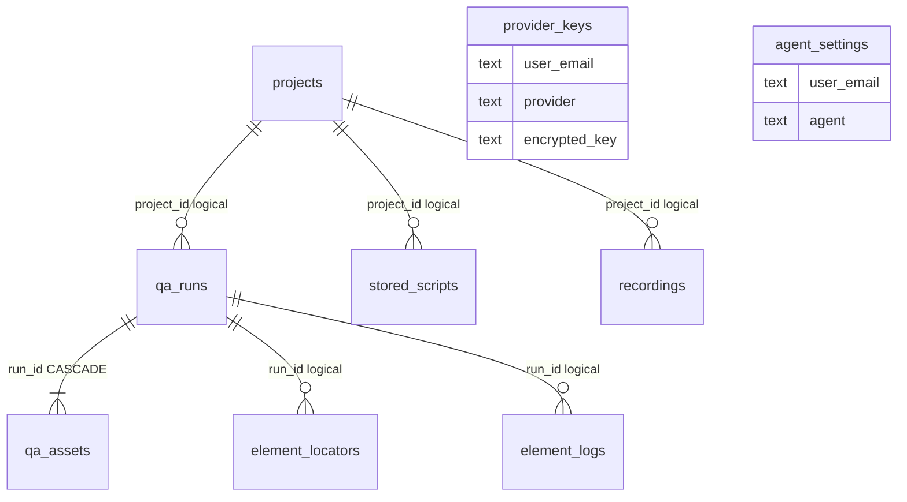

# ZER0 Architecture — V1 (current runtime)

**AI QA orchestration — what ships today.** Multi-agent pipeline with optional LLM enrich (OpenAI · Claude · Gemini) via `@zero/orchestrator/llm`, Playwright crawl + execution, and durable artifacts.

Ground truth: `services/api/server.js`, `services/orchestrator/`, `services/executor/`, `packages/*`, `web/`.

This is **what ships today**. For the IDE-style target and production gaps, see [../v2/ARCHITECTURE.md](../v2/ARCHITECTURE.md). Interactive HTML: `/architecture.html` (source: `web/public/architecture.html`).

**Autonomous packaging / target path:** `support/agent-workflow/` + Cursor skill `/zero-target-arch` (`npm run workflow:status`). Docs site: `support/zero-docs` (`:5174`).

---

## Runtime diagram

```
React web/ ──npm run build──▶ dist/web/
        │
        ▼  POST /runs → queue runs.requested
┌──────────────────┐                 ┌────────────────────────────┐
│  React 18 SPA    │──poll /runs/:id─▶│  Express  @zero/api        │
│  zero-web  :3000 │                 │  zero-api  :3001               │
│  Agents · Keys   │                 └──────┬───────────┬──────────┘
└──────────────────┘                        │           │
        │                                   ▼           ▼
        │ /record · /recorder.js     ┌────────────┐  @zero/executor
        └───────────────────────────▶│ packages/* │  Chromium
          recording events           │ analyzer   │      │
                                     │ builders   │      ▼
                                     │ locators   │  dist/artifacts/<runId>/
                                     │ domain · db│    run.json · screenshots
                                     │ cloud      │  dist/artifacts/cms-captures/
                                     └─────┬──────┘
                                           │  when DATABASE_URL / PGHOST set
                                           ▼
                                     PostgreSQL (@zero/db)
```

Local run modes:

- `npm start` — **API only** (`services/api/server.js`)
- `npm run start:all` — API + orchestrator + executor via `scripts/local-stack.js`
- Compose / production — separate `api`, `orchestrator`, and `executor` services

### Pipeline (`stageKeys` in `@zero/domain`)

Order: `webAnalyzer?` → `ba` → `manualQa` → `automationQa` → `execution` → optional `accessibility` / `performance` / `security` → `manager` → `delivery`.

| Stage | When | What it actually does |
|-------|------|------------------------|
| **webAnalyzer** | No TC file and short/empty notes | Playwright crawl via `@zero/analyzer` (`urlAnalyzerPro`, fallback `urlAnalyzer`); BRD-ish insights, suggested TCs |
| **ba** | Always | Template consolidation (`consolidateRequirements`), then optional LLM enrich via `@zero/orchestrator/llm` |
| **manualQa** | Always | Cases from uploaded CSV / UI manual rows / URL analysis / profile templates; optional LLM extra cases |
| **automationQa** | Always | Merge locators → Playwright + Java/Selenium text; optional LLM locator hints |
| **execution** | Always | Playwright in `@zero/executor`; default **minimal** (`EXECUTION_MODE≠full`) = load URL + body wait + screenshot |
| **accessibility** / **performance** / **security** | UI flags | Extra Playwright passes; security is header/cookie/content heuristics |
| **manager** / **delivery** | Always | Deterministic report builders; Manager may add an LLM narrative when a key exists |

Channel profiles: Gray, TVNZ+, Aha, Hotstar-like, PrimeVideo-like, Generic (+ ecommerce helpers in `@zero/locators/ecommerceSelectors`).

### Persistence (today)

| Store | Mechanism | Survives restart? |
|-------|-----------|-------------------|
| Active runs | `runs` `Map` + `dist/artifacts/<id>/run.json` | Partial (disk JSON) |
| Login secrets | `runSecrets` `Map` | No |
| Recordings | in-memory Maps | No |
| Learned selectors | `selectorMemory` | No |
| Provider keys / agent settings | memory Maps (or DB if enabled) | No unless DB |
| Screenshots | object store (`runs/<id>/files/*`) + local cache under `dist/artifacts/` | Yes (object store) |

**Postgres (M1 shipped):** `databaseConfigured()` is true when `DATABASE_URL` or `PGHOST` is set; `initAllTables()` creates schema via `@zero/db`. Runs upsert to Postgres on each `persistRun`; Map + `dist/artifacts/<id>/run.json` remain a cache/fallback. Login passwords stay in `runSecrets` only.

Full column catalog, indexes, and JSONB mapping: **[DATABASE.md](./DATABASE.md)**. The only enforced FK is `qa_assets.run_id → qa_runs(id) ON DELETE CASCADE`; other `project_id` / `run_id` columns are logical TEXT links.



**Object store (M2 shipped):** `ZERO_CLOUD=local` (default) writes to `dist/artifacts/cloud-store` with HMAC-signed `/cloud/local` URLs (S7 dropped the `/api` prefix). `POST /runs` can return `uploads[]` (presigned PUT) so TC/recording bytes never enter the API process; `POST /runs/:id/commit` starts the pipeline. Screenshots and `run.json` are also stored as objects. `/artifacts` is no longer statically served.

**Multi-cloud (M7 shipped):** `ZERO_CLOUD=aws` (S3 / SQS / Secrets Manager / Redis) and `ZERO_CLOUD=gcp` (GCS / Pub/Sub / Secret Manager / Redis) implement the same `@zero/cloud` contracts. SDKs are lazy-required and live only under `packages/cloud/**`. IaC: `infra/aws`, `infra/gcp`. CI: `.github/workflows/ci.yml` (workflow status + Jest smoke). Azure/Vercel adapters are not complete. Default remains `local`.

**Queue + orchestrator (M3 shipped):** `POST /runs` publishes `runs.requested` via `@zero/cloud` queue and returns 202. `@zero/orchestrator` (`services/orchestrator/`) consumes the topic with `ZERO_ORCH_CONCURRENCY` (default 2). Local queue is in-process when using `npm run start:all` or Compose with shared Redis. Stage snapshots go to `cache` (`state.<runId>`); clients can `GET /runs/:id/stream` (SSE) or keep polling. Standalone: `npm run orchestrator`.

**Execution farm (M4 shipped):** Orchestrator publishes `execution.requested` (one message = one run’s TC batch) and waits for `execution.completed`. `@zero/executor` (`services/executor/`) runs Playwright with `ZERO_EXEC_CONCURRENCY` / `ZERO_EXEC_ATTEMPTS`. The API never subscribes to execution. `npm start` is API-only; use `npm run start:all` (or Compose) for a local all-in-one stack. Screenshots go to the object store. `EXECUTION_MODE=minimal` remains URL-load, not E2E proof.

### Auth & tenancy (M5 shipped)

- Identity is a verified API key (`x-api-key` hashed against `ZERO_API_KEYS` / `ZERO_DEV_API_KEY`) or a Bearer JWT (`ZERO_AUTH_JWT_SECRET` HS256, or RS256 when `OIDC_PUBLIC_KEY` + optional `OIDC_ISSUER` / `OIDC_AUDIENCE` are set). `X-User-Email` is ignored.
- `ZERO_AUTH=on` (always on when `NODE_ENV=production`) returns 401 without a verified identity. Local/dev default is off so the UI keeps working; unauthenticated callers are scoped to tenant `local` only.
- Runs store `tenantId` (Postgres `qa_runs.tenant_id`). List/get/files/download/assets/stream/commit/rerun are tenant-filtered (mismatch → 404).
- Production refuses to boot if `KEY_ENC_SECRET` is missing or still the dev default.

### LLM surface (M6 shipped)

UI stores Claude / OpenAI / Gemini keys (`/provider-keys`) and per-agent model/prompt (`/agent-settings`). `processRun` decrypts the key and calls the provider through `@zero/orchestrator/llm` (`callProvider` → OpenAI `chat.completions`, Anthropic messages, Gemini `generativelanguage`). Template output is always the base; enrichment is best-effort. Guardrails: `ZERO_LLM_RPM` (default 20), `ZERO_LLM_MAX_USD_PER_RUN` (default $0.50), prompt versions `ba.v1` / `manager.v1` / `manualQa.v1` / `automationQa.v1`. `ZERO_LLM=off` forces templates. Env keys (`OPENAI_API_KEY` etc.) are used only when `ZERO_LLM_ENV_KEYS=1`. Artifacts stamp `metadata.llm` (`used`, `provider`, `promptVersion`, `fallbackReason`). Keys are never logged in full.

### Key HTTP surface

S7 dropped the `/api` prefix. The API service (`zero-api`, `:3001`) owns route paths natively.

| Area | Routes |
|------|--------|
| Runs | `POST/GET /runs`, `GET /runs/:id`, `POST …/rerun-failed`, `…/download`, `…/assets` |
| Locators | `POST /element-log`, `GET /locators?host=` |
| Recording | `/recordings/*`, `/record`, `/recorder.js` (CORS allowlist: localhost + `RECORDING_ORIGINS` / `ALLOWED_ORIGINS` — never `*`) |
| CMS | `/capture-cms-screenshot`, `/capture-cms-signal-bulk` |
| Keys / agents | `/provider-keys`, `/agent-settings`, `/keys*` |
| Ops | `/health`, `/health/detailed`, `/api-docs` (Swagger UI — name, not a prefix) |

`/artifacts` returns 404. Files: `GET /runs/:id/files/:name` or a signed `/cloud/local` URL. Download: `GET /runs/:id/download?format=json&url=1` returns `{ url, key }`.
