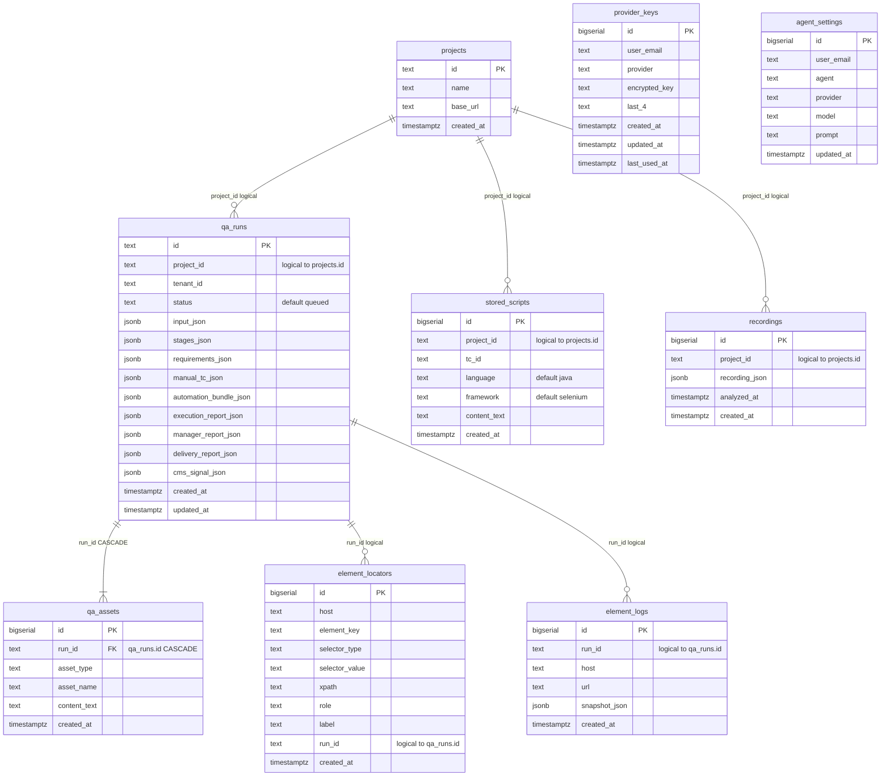

# ZER0 Postgres schema — V1 (current runtime)

Ground truth: `packages/db/lib/schema/` + `packages/db/lib/index.js` (`@zero/db`). This is **what `initAllTables` creates today**. There is no `migrations/` folder and no migrate CLI; tables are `CREATE TABLE IF NOT EXISTS` plus a few `ADD COLUMN IF NOT EXISTS` / `CREATE INDEX IF NOT EXISTS` statements.

Postgres is **optional**. It activates when `DATABASE_URL` or `PGHOST` is set and reachable. Otherwise callers use an in-memory `Map` plus `dist/artifacts/<runId>/run.json`. Login passwords are never stored here (`sanitizeRunInput` strips them; they stay in the process-local `runSecrets` map).

Interactive view: docs site **Tech → Schema · ER** (`#tech-stack` or `#tech-schema`) renders the Mermaid ER and a start-run sequence. Also Architecture LLD **Shared packages**.

---

## ER diagram

Solid `||--o{` on `qa_assets` is the **only enforced foreign key**. Every other `project_id` / `run_id` link is a TEXT column with no `REFERENCES` clause — a logical relationship, not a constraint. There is no `users` table; provider keys and agent settings are keyed by `user_email` string.



ASCII (same story, for terminals). The docs site at `:5174` renders the Mermaid ER and a start-run sequence with `mermaid.render()`:

```
┌──────────────┐
│   projects   │  id PK · name · base_url
└───────┬──────┘
        │  project_id is TEXT — not a REFERENCES
   ┌────┼──────────────┬─────────────────┐
   ▼    ▼              ▼                 │
┌────────────┐  ┌───────────┐    ┌───────┴─────────┐
│ stored_    │  │ recordings│    │    qa_runs      │
│ scripts    │  │           │    │ id PK · status  │
└────────────┘  └───────────┘    │ tenant_id       │
                                 │ 9× JSONB cols   │
                                 └────────┬────────┘
                    FK ON DELETE CASCADE  │  run_id TEXT — not a REFERENCES
                                 ▼        ├──────────────┐
                          ┌────────────┐  ▼              ▼
                          │ qa_assets  │ ┌───────────┐ ┌───────────┐
                          │ (only FK)  │ │ element_  │ │ element_  │
                          └────────────┘ │ locators  │ │ logs      │
                                         └───────────┘ └───────────┘

┌─────────────────┐  ┌─────────────────┐
│  provider_keys  │  │ agent_settings  │   keyed by user_email string
│ UNIQUE(email,   │  │ UNIQUE(email,   │   — no users table
│        provider)│  │        agent)   │
└─────────────────┘  └─────────────────┘
```

---

## Table catalog

Init is four helpers, called in this order from `initAllTables(pool)`:

| Helper | Tables |
|--------|--------|
| `initRunsTables` | `qa_runs`, `qa_assets` |
| `initElementTables` | `element_locators`, `element_logs` |
| `initProjectsTables` | `projects`, `stored_scripts`, `recordings` |
| `initProviderTables` | `provider_keys`, `agent_settings` |

### Relationships

| From | Column | To | Kind | On delete |
|------|--------|----|------|-----------|
| `qa_assets` | `run_id` | `qa_runs.id` | **enforced FK** | `CASCADE` |
| `qa_runs` | `project_id` | `projects.id` | logical (nullable TEXT) | — |
| `stored_scripts` | `project_id` | `projects.id` | logical (NOT NULL TEXT) | — |
| `recordings` | `project_id` | `projects.id` | logical (NOT NULL TEXT) | — |
| `element_locators` | `run_id` | `qa_runs.id` | logical (nullable TEXT) | — |
| `element_logs` | `run_id` | `qa_runs.id` | logical (nullable TEXT) | — |

### `qa_runs` — run row (source of truth when Postgres is on)

| Column | Type | Notes |
|--------|------|-------|
| `id` | TEXT PK | Run id from the API |
| `project_id` | TEXT | From `input.projectId`; **no FK** |
| `status` | TEXT NOT NULL | Default `queued`. Terminal value `completed` (INV-10) |
| `input_json` | JSONB | Sanitized run input (no password, no `tcFileBuffer`) |
| `stages_json` | JSONB | Per-stage status map |
| `requirements_json` | JSONB | BA artifact |
| `manual_tc_json` | JSONB | Manual QA cases |
| `automation_bundle_json` | JSONB | Playwright + Java script text + locator plan |
| `execution_report_json` | JSONB | Executor result |
| `manager_report_json` | JSONB | Manager report |
| `delivery_report_json` | JSONB | Delivery report |
| `cms_signal_json` | JSONB | Optional CMS signal |
| `tenant_id` | TEXT | Added via `ALTER TABLE … ADD COLUMN IF NOT EXISTS`. List/get are tenant-scoped |
| `created_at` / `updated_at` | TIMESTAMPTZ | Default `NOW()` |

Indexes: `idx_qa_runs_project(project_id)`, `idx_qa_runs_created(created_at DESC)`, `idx_qa_runs_tenant(tenant_id)`.

JSONB mapping in `runStore.js` `rowToRun`:

| Column | In-memory field |
|--------|-----------------|
| `input_json` | `run.input` |
| `stages_json` | `run.stages` |
| `requirements_json` | `artifacts.requirements` |
| `manual_tc_json` | `artifacts.manualTestCases` |
| `automation_bundle_json` | `artifacts.automationBundle` |
| `execution_report_json` | `artifacts.executionReport` |
| `manager_report_json` | `artifacts.managerReport` |
| `delivery_report_json` | `artifacts.deliveryReport` |
| `cms_signal_json` | `artifacts.cmsSignalReport` |

### `qa_assets` — generated files as text (replaced on each persist)

| Column | Type | Notes |
|--------|------|-------|
| `id` | BIGSERIAL PK | |
| `run_id` | TEXT NOT NULL | **FK → `qa_runs(id)` ON DELETE CASCADE** |
| `asset_type` | TEXT NOT NULL | See rows written by `replaceAssets` |
| `asset_name` | TEXT NOT NULL | Filename |
| `content_text` | TEXT | Full file body |
| `created_at` | TIMESTAMPTZ | Default `NOW()` |

Index: `idx_qa_assets_run(run_id)`.

`replaceAssets` deletes all rows for the run, then inserts:

| `asset_type` | `asset_name` | Source |
|--------------|--------------|--------|
| `manual_test_cases` | `manual_test_cases.json` | `artifacts.manualTestCases` |
| `automation_script` | `generated.spec.ts` | Playwright spec text |
| `manager_report` | `manager_report.json` | `artifacts.managerReport` |
| `automation_script_java` | `generated.java` | Java/Selenium text (only if present) |

### `projects` / `stored_scripts` / `recordings` — IDE-style (helpers exist; no `/projects` routes yet)

| Table | PK | Notable columns | Index |
|-------|----|-----------------|-------|
| `projects` | `id` TEXT | `name`, `base_url` | — |
| `stored_scripts` | `id` BIGSERIAL | `project_id` NOT NULL, `tc_id`, `language` default `java`, `framework` default `selenium`, `content_text` | `idx_stored_scripts_project` |
| `recordings` | `id` BIGSERIAL | `project_id` NOT NULL, `recording_json` JSONB, `analyzed_at` | `idx_recordings_project` |

### `element_locators` / `element_logs` — selector memory

| Table | Unique / indexes | Notes |
|-------|------------------|-------|
| `element_locators` | UNIQUE(`host`, `element_key`, `selector_value`); `idx_element_locators_host`; `idx_element_locators_host_key` | Upserted by host. Merge order is profile → in-memory learned → this table (`@zero/locators`) |
| `element_logs` | `idx_element_logs_host`; `idx_element_logs_run` | Raw snapshot from `POST /element-log` (`url` + `snapshot_json`) |

### `provider_keys` / `agent_settings` — LLM config (per email string)

| Table | Unique | Notes |
|-------|--------|-------|
| `provider_keys` | (`user_email`, `provider`) | Stores **encrypted** key + `last_4`. List helpers never return `encrypted_key` except `getEncryptedProviderKey`. Index `idx_provider_keys_user` |
| `agent_settings` | (`user_email`, `agent`) | `provider`, `model`, `prompt`. Index `idx_agent_settings_user` |

---

## What is not in Postgres

| Concern | Where it lives |
|---------|----------------|
| Login passwords | Process `runSecrets` Map only — stripped from `input_json` and `run.json` |
| TC / recording bytes | Object store (`@zero/cloud`), not a bytea column |
| Screenshots | Object store + local cache under `dist/artifacts/` |
| In-memory learned selectors | `selectorMemory` (process) until upserted to `element_locators` |
| Recording sessions | In-memory Maps unless a row is written to `recordings` |
| Outbox / migrate version | Not created yet (V3 still wants `outbox_events` + `migrations/`) |

---

## Run-store API (`packages/db`)

Implementation: `packages/db/lib/runStore.js` (re-exported from `packages/db/runStore.js`).

Callers should use these helpers, not ad-hoc SQL:

| Helper | Writes / reads |
|--------|----------------|
| `upsertRun` / `getRunById` / `listRunRows` | `qa_runs` (list is tenant-filtered when `tenantId` is passed) |
| `replaceAssets` / `listAssetsByRunId` | `qa_assets` |
| `upsertLocator` / `getLocatorsByHost` | `element_locators` |
| `insertElementLog` / `getElementLogsByHost` | `element_logs` |
| `createProject` / `listProjects` / `getProject` | `projects` |
| `insertStoredScript` / `getStoredScriptsByProject` | `stored_scripts` |
| `insertRecording` | `recordings` |
| `listProviderKeys` / `upsertProviderKey` / `deleteProviderKey` / `getEncryptedProviderKey` | `provider_keys` |
| `listAgentSettings` / `upsertAgentSettings` | `agent_settings` |

`packages/db/runStore.js` wraps `upsertRun` with file + object-store writes so a missing or down Postgres still leaves `dist/artifacts/<id>/run.json`.
